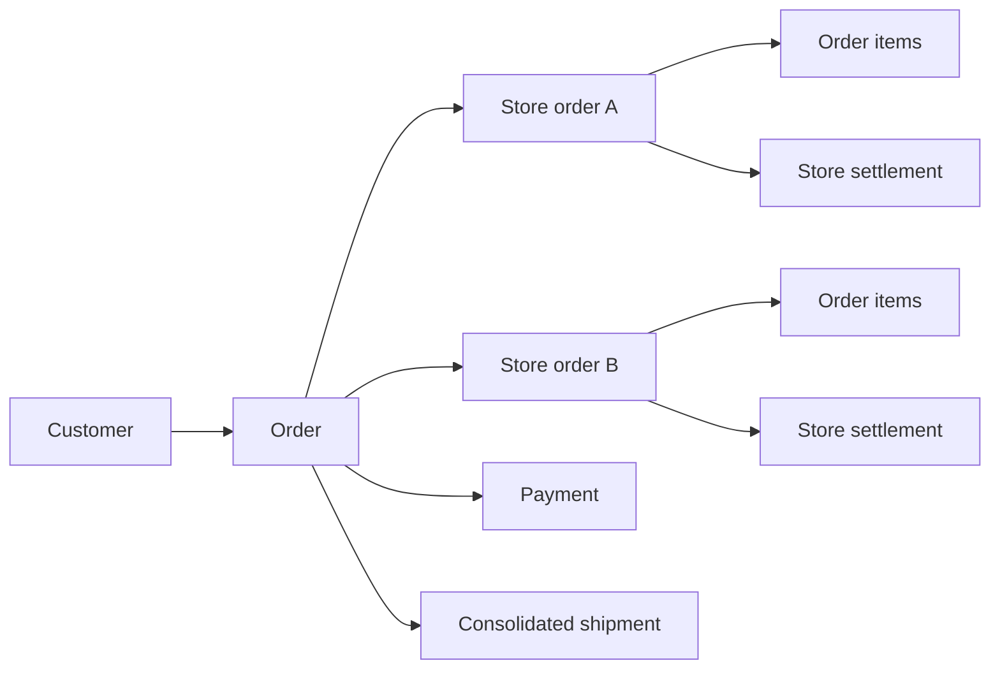
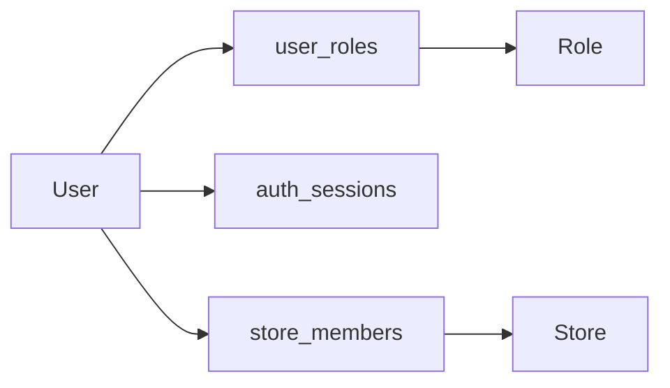

# Gami Database Dictionary

## 1. Document purpose

This document explains how the Gami MVP 1 database supports the marketplace. It is intended for backend developers, data analysts, operations staff, and future maintainers who need to understand what each table stores, why it exists, and how it relates to the rest of the platform.

The executable sources of truth remain:

- `schema.prisma` for entities, columns, relations, indexes, and Prisma types.
- `migrations/` for the PostgreSQL DDL, check constraints, triggers, and migration history.
- `seed.ts` for required roles, platform settings, and the initial administrator.

This dictionary describes database schema version **Gami MVP 1 Foundation**. It must be updated in the same change whenever a migration adds, removes, or changes a table or business-significant column.

## 2. Core business model

Gami is a multi-store marketplace. A customer places one Gami order, pays once, and receives one consolidated shipment. Internally, that order is divided into one store order per participating store. Each store confirms or rejects only its own portion.



Identity and authorization are intentionally separated:



- `user_roles` answers **what the user is allowed to do**.
- `store_members` answers **which store the user can operate**.
- A user can have multiple roles, and a role can be assigned to multiple users.
- A user can belong to multiple stores without duplicating their identity or credentials.

## 3. Database conventions

| Convention    | Meaning                                                                                                                                                      |
| ------------- | ------------------------------------------------------------------------------------------------------------------------------------------------------------ |
| Primary keys  | Business entities use UUIDs. `audit_log` uses an increasing `BIGSERIAL` optimized for append-only history.                                                   |
| Foreign keys  | Every relational identifier has a PostgreSQL foreign key. Historical references normally use `RESTRICT`. Optional actor references use `SET NULL`.           |
| Money         | Monetary values are integers in cents, such as `total_in_cents`. Floating-point money is prohibited.                                                         |
| Currency      | ISO 4217 three-letter code. MVP 1 defaults to `PEN`.                                                                                                         |
| Rates         | Percentage rates use basis points. `100` means 1% and `10000` means 100%.                                                                                    |
| Time          | Instants are stored in UTC as `timestamp(3)`. Presentation converts them to the user's timezone.                                                             |
| Soft deletion | Referenced identities and catalog records use `deleted_at` instead of physical deletion.                                                                     |
| Snapshots     | Order items copy names, SKU, size, color, and price so historical sales do not change when the catalog changes.                                              |
| JSONB         | Used for provider payloads, evidence, metadata, and intentionally flexible attributes. It does not replace normal foreign keys.                              |
| Idempotency   | Provider and financial operations use unique external IDs or idempotency keys to prevent duplicate processing.                                               |
| Append-only   | `audit_log`, `ledger_entries`, `customer_credits`, and `stock_movements` reject `UPDATE` and `DELETE` in PostgreSQL. Corrections require a compensating row. |

Common lifecycle columns:

| Column       | Meaning                                                                                          |
| ------------ | ------------------------------------------------------------------------------------------------ |
| `created_at` | When the record was created.                                                                     |
| `updated_at` | When the mutable record was last changed.                                                        |
| `deleted_at` | Soft-delete marker. `NULL` means the record remains active unless another status says otherwise. |

## 4. Identity and access

### `users`

**Purpose:** Stores platform identities and authentication credentials for administrators, store operators, and optionally registered customers. It is the central actor table used by audit fields throughout the system.

| Column                 | Role                                                                |
| ---------------------- | ------------------------------------------------------------------- |
| `id`                   | UUID primary key.                                                   |
| `username`             | Unique login name.                                                  |
| `display_name`         | Human-readable name shown in interfaces and audit views.            |
| `email`, `phone`       | Optional unique contact identifiers.                                |
| `password_hash`        | One-way password hash. Plain-text passwords must never be stored.   |
| `must_change_password` | Forces replacement of seeded or administratively reset credentials. |
| `password_changed_at`  | Timestamp of the last completed password change.                    |
| `status`               | `ACTIVE`, `SUSPENDED`, or `DISABLED`.                               |
| `last_login_at`        | Last successful authentication timestamp.                           |
| `deleted_at`           | Soft deletion while preserving historical actor references.         |

**Relationships:** Many roles through `user_roles`; many stores through `store_members`; optional customer profile through `customers`; referenced as the actor in confirmations, stock operations, resolutions, payouts, and audit records.

### `auth_sessions`

**Purpose:** Stores revocable login sessions and refresh-token rotation state. Access tokens reference a session, allowing logout, password changes, account suspension, and token-reuse detection to invalidate access before JWT expiration.

| Column                        | Role                                                                                                        |
| ----------------------------- | ----------------------------------------------------------------------------------------------------------- |
| `id`                          | UUID session identifier included in the access token as `sid`.                                              |
| `user_id`                     | FK to the authenticated user.                                                                               |
| `family_id`                   | Groups every refresh-token rotation descended from one login.                                               |
| `token_hash`                  | Unique SHA-256 hash of the opaque refresh token. The raw token is never stored.                             |
| `expires_at`                  | Absolute refresh-session expiration.                                                                        |
| `last_used_at`                | Last successful refresh timestamp for this token generation.                                                |
| `revoked_at`, `revoke_reason` | Revocation state and cause, such as logout, rotation, password change, or token reuse.                      |
| `ip_address`, `user_agent`    | Diagnostic context captured at session creation. These fields must follow the retention and privacy policy. |
| `created_at`                  | Session creation timestamp.                                                                                 |

**Rules:** Refresh rotates on every use. Reusing a revoked refresh token revokes its entire `family_id`. Deleting a user cascades to sessions because sessions are credentials, not immutable business history.

### `roles`

**Purpose:** Defines reusable authorization groups such as `SUPER_ADMIN`, `CATALOG_MANAGER`, `OPERATIONS_MANAGER`, `WAREHOUSE_OPERATOR`, `FINANCE_MANAGER`, and `STORE_OPERATOR`.

| Column                | Role                                                           |
| --------------------- | -------------------------------------------------------------- |
| `id`                  | UUID primary key.                                              |
| `code`                | Unique stable identifier used by authorization code.           |
| `name`, `description` | Human-readable role information.                               |
| `system`              | Distinguishes platform-managed roles from future custom roles. |

**Relationships:** Assigned to users through `user_roles`.

### `user_roles`

**Purpose:** Many-to-many bridge between users and roles. It avoids limiting a user to one role and provides grant auditability.

| Column          | Role                                              |
| --------------- | ------------------------------------------------- |
| `user_id`       | FK to `users`; part of the composite primary key. |
| `role_id`       | FK to `roles`; part of the composite primary key. |
| `granted_by_id` | Optional FK to the user who granted the role.     |
| `granted_at`    | Grant timestamp.                                  |

**Rules:** The composite key prevents assigning the same role to the same user twice. Deleting a user removes their assignments; deleting a referenced role is restricted.

### `store_members`

**Purpose:** Links platform users to the stores they are authorized to operate. This is tenancy scope, not an application permission.

| Column     | Role                                                            |
| ---------- | --------------------------------------------------------------- |
| `user_id`  | FK to `users`; part of the composite primary key.               |
| `store_id` | FK to `stores`; part of the composite primary key.              |
| `is_owner` | Marks the business owner among store members.                   |
| `active`   | Allows access to be disabled without losing membership history. |

**Rules:** One user/store pair can exist only once. User and store deletion is restricted while the membership exists.

## 5. Stores and catalog

### `stores`

**Purpose:** Stores the commercial and operational record of each marketplace seller.

| Column                       | Role                                                                           |
| ---------------------------- | ------------------------------------------------------------------------------ |
| `id`                         | UUID primary key.                                                              |
| `display_name`, `legal_name` | Public and legal business names.                                               |
| `gallery`, `stand_number`    | Physical Gamarra location.                                                     |
| `whatsapp_number`            | Unique number used for operational confirmation.                               |
| `whatsapp_verified_at`       | Verification timestamp for that number.                                        |
| `status`                     | Application, review, activation, suspension, rejection, and closure lifecycle. |
| `deleted_at`                 | Soft deletion preserving order history.                                        |

**Relationships:** Owns products, schedules, members, store orders, strikes, ledger entries, and payouts.

### `store_hours`

**Purpose:** Defines recurring operating windows for a store. Multiple rows on one weekday support split shifts.

| Column                  | Role                             |
| ----------------------- | -------------------------------- |
| `store_id`              | FK to `stores`.                  |
| `day_of_week`           | Integer from 0 through 6.        |
| `opens_at`, `closes_at` | Opening and closing local times. |

**Rules:** Opening time must precede closing time. A store cannot repeat the same weekday/opening-time pair.

### `store_closures`

**Purpose:** Records exceptional closures that override recurring store hours, such as holidays or temporary unavailability.

| Column                 | Role                                     |
| ---------------------- | ---------------------------------------- |
| `store_id`             | FK to `stores`.                          |
| `starts_at`, `ends_at` | Closed interval. Start must precede end. |
| `reason`               | Optional operational explanation.        |

### `products`

**Purpose:** Stores the seller-owned catalog listing and its publication lifecycle.

| Column                                          | Role                                                                                                         |
| ----------------------------------------------- | ------------------------------------------------------------------------------------------------------------ |
| `store_id`                                      | FK to the seller in `stores`.                                                                                |
| `name`, `description`                           | Customer-facing product content.                                                                             |
| `category`, `garment_type`                      | Search and merchandising classification.                                                                     |
| `unit_price_in_cents`                           | Retail price in cents.                                                                                       |
| `wholesale_price_in_cents`, `wholesale_minimum` | Optional wholesale offer.                                                                                    |
| `attributes`                                    | Flexible JSONB data retained for compatibility. Structured searchable values belong in `product_attributes`. |
| `status`                                        | Draft, review, approval, publication, suspension, or rejection lifecycle.                                    |
| `deleted_at`                                    | Soft deletion preserving order references.                                                                   |

**Relationships:** Belongs to one store; owns variants and structured attributes.

### `product_attributes`

**Purpose:** Stores searchable and controlled catalog characteristics outside the fixed product columns.

| Column       | Role                                                            |
| ------------ | --------------------------------------------------------------- |
| `product_id` | FK to `products`.                                               |
| `code`       | Stable attribute identifier, for example `material` or `style`. |
| `value`      | Selected controlled value.                                      |
| `position`   | Display ordering.                                               |

**Rules:** The same code/value pair cannot be repeated on one product.

### `variants`

**Purpose:** Represents the sellable size and color combination where stock actually exists.

| Column            | Role                                                       |
| ----------------- | ---------------------------------------------------------- |
| `product_id`      | FK to the parent product.                                  |
| `sku`             | Globally unique stock keeping unit.                        |
| `size_normalized` | Standardized size used for filters and matching.           |
| `size_label`      | Original customer-facing size label.                       |
| `color`           | Variant color.                                             |
| `active`          | Controls whether the variant can participate in new sales. |

**Rules:** A product cannot repeat the same normalized-size/color combination.

## 6. Inventory

### `inventory`

**Purpose:** Stores the current available quantity for each variant. Reserved and sold quantities are not separate states in this table.

| Column             | Role                                                              |
| ------------------ | ----------------------------------------------------------------- |
| `variant_id`       | Unique FK to `variants`, enforcing one inventory row per variant. |
| `quantity`         | Current available quantity; cannot be negative.                   |
| `stock_updated_at` | Business timestamp used to measure stock freshness.               |

### `stock_movements`

**Purpose:** Immutable inventory ledger from which historical sales and adjustments can be reconstructed.

| Column          | Role                                                          |
| --------------- | ------------------------------------------------------------- |
| `variant_id`    | FK to the affected variant.                                   |
| `order_item_id` | Optional FK connecting a sale or release to an order item.    |
| `actor_user_id` | Optional FK to the user who caused the movement.              |
| `type`          | Initial stock, adjustment, restock, sale, release, or return. |
| `quantity`      | Signed non-zero change.                                       |
| `balance_after` | Non-negative inventory balance after applying the change.     |
| `reason`        | Human-readable justification.                                 |

**Rules:** Append-only. Corrections are new compensating movements, never edits.

### `stock_holds`

**Purpose:** Prevents the same units from being sold to two customers while checkout and store confirmation are in progress.

| Column                                    | Role                                                   |
| ----------------------------------------- | ------------------------------------------------------ |
| `variant_id`                              | FK to the reserved variant.                            |
| `order_id`, `order_item_id`               | FKs to the checkout/order and optional finalized item. |
| `quantity`                                | Positive reserved quantity.                            |
| `status`                                  | `LIVE`, `FIRM`, `CONSUMED`, or `RELEASED`.             |
| `expires_at`                              | Required for live unpaid holds.                        |
| `firmed_at`, `consumed_at`, `released_at` | Lifecycle timestamps.                                  |

**Lifecycle:** A checkout creates `LIVE`; payment makes it `FIRM`; store confirmation makes it `CONSUMED`; expiry, rejection, or cancellation makes it `RELEASED`.

### `stock_declarations`

**Purpose:** Records advance stock declared by a store so products can remain sellable outside operating hours.

| Column                      | Role                                         |
| --------------------------- | -------------------------------------------- |
| `variant_id`                | FK to the declared variant.                  |
| `declared_by_id`            | FK to the responsible user.                  |
| `declared_quantity`         | Verified quantity at declaration time.       |
| `overnight_limit`           | Maximum quantity exposed to overnight sales. |
| `declared_at`, `expires_at` | Validity interval.                           |

**Rules:** Values cannot be negative, the overnight limit cannot exceed declared quantity, and expiry must follow declaration.

## 7. Customers and delivery addresses

### `customers`

**Purpose:** Stores the buyer business profile independently from authentication. Guest buyers can exist without a `users` row and later be linked to an account.

| Column                        | Role                                    |
| ----------------------------- | --------------------------------------- |
| `user_id`                     | Optional unique FK to `users`.          |
| `full_name`, `email`, `phone` | Buyer identity and contact data.        |
| `deleted_at`                  | Soft deletion preserving order history. |

**Relationships:** Owns addresses, orders, credit ledger entries, and analytics events.

### `addresses`

**Purpose:** Stores customer destinations for Lima delivery, province delivery, or agency pickup.

| Column                                             | Role                                                  |
| -------------------------------------------------- | ----------------------------------------------------- |
| `customer_id`                                      | FK to `customers`.                                    |
| `label`                                            | Optional customer label such as Home or Office.       |
| `recipient_name`, `recipient_phone`                | Delivery contact snapshot.                            |
| `zone_type`                                        | `LIMA`, `PROVINCE`, or `AGENCY`.                      |
| `city`, `district`, `agency`, `line1`, `reference` | Location data used according to zone type.            |
| `is_default`                                       | Marks the customer's default active address.          |
| `deleted_at`                                       | Soft deletion preserving orders that use the address. |

**Rules:** A customer can have at most one non-deleted default address.

## 8. Sales

### `orders`

**Purpose:** Represents the customer's complete Gami purchase: one checkout, one payment, one delivery promise, and one consolidated shipment.

| Column                                                                          | Role                                                         |
| ------------------------------------------------------------------------------- | ------------------------------------------------------------ |
| `order_number`                                                                  | Unique human-readable business identifier.                   |
| `customer_id`                                                                   | FK to the buyer.                                             |
| `shipping_address_id`                                                           | FK to the selected delivery address.                         |
| `status`                                                                        | Overall sale lifecycle from pending payment through closure. |
| `subtotal_in_cents`, `shipping_in_cents`, `discount_in_cents`, `total_in_cents` | Frozen order totals.                                         |
| `promised_delivery_start_at`, `promised_delivery_end_at`                        | Frozen delivery promise shown at checkout.                   |
| `placed_at`, `cancelled_at`                                                     | Business lifecycle timestamps.                               |

**Rules:** Total must equal subtotal plus shipping minus discount. Delivery promise start cannot follow its end.

### `store_orders`

**Purpose:** Represents the portion of an order assigned to one store. Store confirmation, SLA, commission snapshot, fulfillment exceptions, and settlement all operate at this level.

| Column                                                            | Role                                                        |
| ----------------------------------------------------------------- | ----------------------------------------------------------- |
| `order_id`                                                        | FK to the parent Gami order.                                |
| `store_id`                                                        | FK to the responsible store.                                |
| `status`                                                          | Independent store-order confirmation and fulfillment state. |
| `commercial_model`                                                | `AGENCY` for the MVP or reserved `RESELLER` mode.           |
| `commission_rate_basis_points`                                    | Commission rate snapshot valid when the sale occurred.      |
| `subtotal_in_cents`, `commission_in_cents`, `net_amount_in_cents` | Store-specific financial snapshots.                         |
| `confirmation_channel`                                            | WhatsApp, store panel, admin panel, or system.              |
| `confirmed_by_id`                                                 | Optional FK to the confirming user.                         |
| `confirmation_requested_at`, `confirmation_due_at`                | SLA interval.                                               |
| `confirmed_at`, `rejected_at`                                     | Outcome timestamps.                                         |

**Rules:** Only one store order may exist for a given order/store pair. Amounts and commission rate cannot be negative.

### `order_items`

**Purpose:** Stores purchased variants and immutable sale snapshots inside a store order.

| Column                                       | Role                                |
| -------------------------------------------- | ----------------------------------- |
| `store_order_id`                             | FK to the owning store order.       |
| `variant_id`                                 | FK to the original catalog variant. |
| `product_name`, `sku`, `size_label`, `color` | Frozen catalog snapshot.            |
| `quantity`                                   | Positive purchased quantity.        |
| `unit_price_in_cents`, `total_in_cents`      | Frozen unit and line totals.        |

**Rules:** Line total must equal quantity multiplied by unit price. Catalog changes never rewrite these snapshots.

### `payments`

**Purpose:** Stores the payment attempt and provider-confirmed state for an order. Provider webhooks are the source of truth.

| Column                                                     | Role                                                                     |
| ---------------------------------------------------------- | ------------------------------------------------------------------------ |
| `order_id`                                                 | Unique FK, enforcing at most one current payment record per order.       |
| `provider`, `provider_payment_id`                          | Payment provider and unique remote identifier.                           |
| `idempotency_key`                                          | Unique application key preventing duplicate payment creation.            |
| `status`                                                   | Pending, authorized, captured, failed, cancelled, or refunded lifecycle. |
| `amount_in_cents`, `currency`                              | Requested payment amount and currency.                                   |
| `authorized_at`, `captured_at`, `failed_at`, `refunded_at` | Provider-confirmed timestamps.                                           |
| `provider_data`                                            | Sanitized provider metadata for reconciliation.                          |

## 9. Communication, fulfillment, and delivery

### `whatsapp_messages`

**Purpose:** Complete message log for store-order confirmation over WhatsApp.

| Column                                              | Role                                                   |
| --------------------------------------------------- | ------------------------------------------------------ |
| `store_order_id`                                    | FK to the store order being discussed.                 |
| `provider_message_id`                               | Unique provider identifier for webhook deduplication.  |
| `direction`                                         | Inbound or outbound.                                   |
| `status`                                            | Queue, delivery, read, failure, or receipt state.      |
| `template_name`, `body`                             | Template and message content.                          |
| `raw_response`, `classification`                    | Original store response and normalized interpretation. |
| `provider_data`                                     | Provider metadata.                                     |
| `sent_at`, `delivered_at`, `read_at`, `received_at` | Communication timestamps used by the confirmation SLA. |

### `shipments`

**Purpose:** Tracks the single consolidated shipment created for a Gami order.

| Column                                                                 | Role                                                                          |
| ---------------------------------------------------------------------- | ----------------------------------------------------------------------------- |
| `order_id`                                                             | Unique FK, enforcing one shipment per order in MVP 1.                         |
| `status`                                                               | Pickup, consolidation, dispatch, transit, delivery, failure, or return state. |
| `method`, `provider`, `tracking_code`                                  | Delivery method and optional courier identifiers.                             |
| `shipping_rate_in_cents`                                               | Frozen shipping cost.                                                         |
| `pickup_scheduled_at`, `picked_up_at`, `dispatched_at`, `delivered_at` | Fulfillment milestones.                                                       |
| `provider_data`                                                        | Courier metadata used for reconciliation and support.                         |

### `fulfillment_exceptions`

**Purpose:** Records operational failures affecting a store order and their controlled resolution.

| Column                                             | Role                                                                                                      |
| -------------------------------------------------- | --------------------------------------------------------------------------------------------------------- |
| `store_order_id`                                   | FK to the affected store order.                                                                           |
| `type`                                             | No response, out of stock, mismatch, damage, quality rejection, courier loss, delivery failure, or other. |
| `description`                                      | Human-readable incident details.                                                                          |
| `affected_items`, `evidence`                       | Structured affected-item references and evidence metadata.                                                |
| `resolution`                                       | Closed list of allowed business resolutions.                                                              |
| `resolution_note`, `resolved_by_id`, `resolved_at` | Resolution explanation, responsible user FK, and timestamp.                                               |

## 10. Store discipline

### `strikes`

**Purpose:** Records a store fault used to calculate operational discipline and automatic suspension.

| Column                                    | Role                                                                  |
| ----------------------------------------- | --------------------------------------------------------------------- |
| `store_id`                                | FK to the penalized store.                                            |
| `source_store_order_id`                   | Optional FK to the event-producing store order.                       |
| `created_by_id`                           | Optional FK to the admin or system user responsible for registration. |
| `type`, `reason`, `evidence`              | Controlled fault type and supporting details.                         |
| `status`                                  | Active, expired, or revoked.                                          |
| `occurred_at`, `expires_at`, `revoked_at` | Lifecycle timestamps.                                                 |

**Rules:** Expiry must follow occurrence. The seeded setting `active_strike_limit` controls suspension and `strike_expiration_days` controls expiry.

### `appeals`

**Purpose:** Stores the single appeal allowed for a strike and its administrative decision.

| Column                                           | Role                                                             |
| ------------------------------------------------ | ---------------------------------------------------------------- |
| `strike_id`                                      | Unique FK to `strikes`, enforcing at most one appeal per strike. |
| `status`                                         | Pending, approved, or rejected.                                  |
| `statement`, `evidence`                          | Store argument and supporting material.                          |
| `reviewed_by_id`                                 | Optional FK to the reviewing administrator.                      |
| `resolution_note`, `submitted_at`, `reviewed_at` | Decision and lifecycle data.                                     |

## 11. Finance

### `pending_settlements`

**Purpose:** Represents the financial reserve owed for one confirmed store order before it becomes part of a payout.

| Column                                                                | Role                                                         |
| --------------------------------------------------------------------- | ------------------------------------------------------------ |
| `store_order_id`                                                      | Unique FK, enforcing at most one settlement per store order. |
| `payout_id`                                                           | Optional FK to the payout batch that settles it.             |
| `status`                                                              | Pending, available, scheduled, paid, held, or cancelled.     |
| `gross_amount_in_cents`, `commission_in_cents`, `net_amount_in_cents` | Frozen settlement calculation.                               |
| `available_at`                                                        | Earliest time the reserve may be paid.                       |

### `payouts`

**Purpose:** Groups money transferred to one store and stores the payment evidence.

| Column                             | Role                                                      |
| ---------------------------------- | --------------------------------------------------------- |
| `store_id`                         | FK to the recipient store.                                |
| `status`                           | Draft, processing, paid, failed, or cancelled.            |
| `amount_in_cents`, `currency`      | Payout total.                                             |
| `payment_reference`, `receipt_url` | Unique transfer reference and evidence location.          |
| `marked_by_id`                     | Optional FK to the finance user who recorded the payment. |
| `scheduled_at`, `paid_at`          | Payout milestones.                                        |

### `ledger_entries`

**Purpose:** Immutable accounting ledger for each store. It records sales, commissions, payouts, refunds, compensations, and adjustments.

| Column                        | Role                                                |
| ----------------------------- | --------------------------------------------------- |
| `store_id`                    | FK to the ledger owner.                             |
| `store_order_id`, `payout_id` | Optional FKs to the originating business records.   |
| `type`                        | Accounting movement category.                       |
| `amount_in_cents`             | Signed ledger amount.                               |
| `idempotency_key`             | Unique key preventing duplicate financial postings. |
| `description`, `metadata`     | Explanation and structured reconciliation data.     |

**Rules:** Append-only. Corrections require reversing and replacement entries.

### `compensations`

**Purpose:** Tracks the resolution granted for a specific problematic order item: refund, credit, replacement, or internal adjustment.

| Column                        | Role                                                            |
| ----------------------------- | --------------------------------------------------------------- |
| `order_item_id`               | FK to the affected purchased item.                              |
| `approved_by_id`              | Optional FK to the approving administrator.                     |
| `type`, `status`              | Compensation mechanism and lifecycle.                           |
| `amount_in_cents`, `currency` | Optional monetary value. Replacement may not require an amount. |
| `reason`, `completed_at`      | Business justification and completion timestamp.                |

### `customer_credits`

**Purpose:** Immutable customer credit ledger. The current balance is derived from its entries, while `balance_after` supports reconciliation.

| Column            | Role                                               |
| ----------------- | -------------------------------------------------- |
| `customer_id`     | FK to the credit owner.                            |
| `order_id`        | Optional FK to the originating order.              |
| `amount_in_cents` | Signed credit movement.                            |
| `balance_after`   | Non-negative balance after the movement.           |
| `idempotency_key` | Unique key preventing duplicate credits or debits. |
| `reason`          | Human-readable justification.                      |

**Rules:** Append-only. Customer credit does not expire in MVP 1.

## 12. Platform configuration and integrations

### `settings`

**Purpose:** Stores configurable business numbers so rules are not hardcoded in backend or frontend code.

| Column        | Role                                                                            |
| ------------- | ------------------------------------------------------------------------------- |
| `key`         | Stable string primary key used by application code.                             |
| `value`       | JSONB value supporting numbers, booleans, strings, or structured configuration. |
| `description` | Operational explanation.                                                        |

**Seeded examples:** Stock-hold TTL, confirmation SLA, WhatsApp delivery tolerance, strike threshold, strike lifetime, and appeal window.

### `logistics_calendar`

**Purpose:** Defines whether a calendar date is operational for pickup, consolidation, dispatch, and delivery calculations.

| Column           | Role                                       |
| ---------------- | ------------------------------------------ |
| `date`           | Date primary key.                          |
| `is_working_day` | Whether logistics may operate on the date. |
| `description`    | Holiday or operational note.               |

### `shipping_rates`

**Purpose:** Versioned price matrix used to calculate delivery cost by zone, district, and item-count tier.

| Column                                     | Role                        |
| ------------------------------------------ | --------------------------- |
| `zone_type`, `district`                    | Geographic applicability.   |
| `min_items`, `max_items`                   | Inclusive item-count range. |
| `rate_in_cents`, `currency`                | Shipping price.             |
| `active`, `effective_from`, `effective_to` | Rate validity.              |

**Rules:** Item and amount values cannot be negative; end of validity must follow its start.

### `integration_events`

**Purpose:** Idempotent inbox for external webhooks from payment, WhatsApp, and courier providers.

| Column                          | Role                                                                        |
| ------------------------------- | --------------------------------------------------------------------------- |
| `provider`, `external_event_id` | Composite unique identity supplied by the external system.                  |
| `event_type`                    | Provider event category.                                                    |
| `status`                        | Received, processing, processed, failed, or ignored.                        |
| `payload`                       | Original JSONB webhook payload. Secrets must be removed before persistence. |
| `attempts`, `last_error`        | Retry diagnostics.                                                          |
| `received_at`, `processed_at`   | Processing lifecycle timestamps.                                            |

**Rules:** The unique provider/event pair prevents the same webhook from changing state twice.

### `user_events`

**Purpose:** Product analytics stream used to measure discovery, conversion, unique customers, repeat purchase, and other MVP metrics.

| Column        | Role                                                                                |
| ------------- | ----------------------------------------------------------------------------------- |
| `customer_id` | Optional FK for identified customers.                                               |
| `session_id`  | Anonymous or authenticated browsing session.                                        |
| `event_name`  | Stable analytics event name.                                                        |
| `properties`  | Event-specific JSONB dimensions. Sensitive personal data should not be stored here. |
| `occurred_at` | Client event timestamp accepted by the backend.                                     |

### `audit_log`

**Purpose:** Immutable record of business state transitions: who changed what, from which state to which state, through which channel, and why.

| Column                     | Role                                                                                                                    |
| -------------------------- | ----------------------------------------------------------------------------------------------------------------------- |
| `id`                       | Increasing `BIGSERIAL` primary key.                                                                                     |
| `actor_user_id`            | Optional FK to the responsible user. `NULL` represents an external or system actor.                                     |
| `entity_type`, `entity_id` | Polymorphic business entity reference. `entity_id` is intentionally not an FK because it can identify different tables. |
| `action`                   | Stable transition or action name.                                                                                       |
| `from_state`, `to_state`   | State transition snapshot.                                                                                              |
| `channel`                  | API, customer app, store panel, admin panel, WhatsApp, webhook, scheduled job, or system.                               |
| `reason`, `metadata`       | Explanation and structured supporting context.                                                                          |
| `occurred_at`              | Immutable event timestamp.                                                                                              |

**Rules:** Append-only. The database rejects updates and deletes.

## 13. Relationship map

| Parent         | Child                 | Cardinality | Business meaning                                   |
| -------------- | --------------------- | ----------- | -------------------------------------------------- |
| `users`        | `user_roles`          | 1:N         | One user can receive multiple roles.               |
| `roles`        | `user_roles`          | 1:N         | One role can be assigned to multiple users.        |
| `users`        | `store_members`       | 1:N         | One identity can operate multiple stores.          |
| `stores`       | `store_members`       | 1:N         | One store can have multiple operators.             |
| `stores`       | `products`            | 1:N         | A store publishes many products.                   |
| `products`     | `variants`            | 1:N         | A product is sold through size/color variants.     |
| `variants`     | `inventory`           | 1:1         | Every stocked variant has one current balance.     |
| `customers`    | `addresses`           | 1:N         | A customer can save multiple destinations.         |
| `customers`    | `orders`              | 1:N         | A customer can place multiple orders.              |
| `orders`       | `store_orders`        | 1:N         | A marketplace order is split by store.             |
| `store_orders` | `order_items`         | 1:N         | Each store order contains its purchased variants.  |
| `orders`       | `payments`            | 1:0..1      | MVP 1 stores one current payment per order.        |
| `orders`       | `shipments`           | 1:0..1      | MVP 1 consolidates an order into one shipment.     |
| `store_orders` | `pending_settlements` | 1:0..1      | Each confirmed store order can create one reserve. |
| `payouts`      | `pending_settlements` | 1:N         | One payout can settle multiple store orders.       |
| `stores`       | `ledger_entries`      | 1:N         | Each store owns an immutable financial ledger.     |
| `strikes`      | `appeals`             | 1:0..1      | A strike can be appealed once.                     |

## 14. End-to-end data flow

1. A seller exists in `stores`; its operators are linked through `store_members` and authorized through `user_roles`.
2. The seller publishes `products` and `variants`; current availability lives in `inventory` and changes are recorded in `stock_movements`.
3. A buyer exists in `customers` and chooses one of their `addresses`.
4. Checkout creates an `orders` row, one `store_orders` row per seller, `order_items`, and temporary `stock_holds`.
5. The payment provider sends a webhook. `integration_events` deduplicates it and `payments` stores the authoritative payment state.
6. Payment makes stock holds firm. Each store receives confirmation through `whatsapp_messages` or the store panel.
7. Confirmation consumes holds and creates `stock_movements`; rejection or cancellation releases them.
8. Operations records pickup, consolidation, and delivery in `shipments`. Problems are registered in `fulfillment_exceptions`.
9. Confirmed sales create `pending_settlements` and immutable `ledger_entries`. Finance groups payable reserves into `payouts`.
10. Every state transition writes an immutable `audit_log` row. Customer behavior writes `user_events` for MVP measurement.

## 15. Deletion and retention policy

| Data class                                                     | Policy                                                                                                                              |
| -------------------------------------------------------------- | ----------------------------------------------------------------------------------------------------------------------------------- |
| Users, customers, stores, products, addresses                  | Soft delete where `deleted_at` exists. Anonymization may be added for privacy obligations without deleting financial history.       |
| Orders, order items, payments, shipments, settlements, payouts | Retain as business history. Foreign keys restrict accidental deletion.                                                              |
| Audit, inventory ledger, store ledger, customer credit ledger  | Append-only. Never update or delete through normal application operations.                                                          |
| Integration payloads                                           | Retain only as long as required for retries, reconciliation, and support. Define an operational retention period before production. |
| Analytics events                                               | Apply a documented retention policy and avoid unnecessary personal data.                                                            |

## 16. Ownership and update rules

| Area                    | Allowed writer                                                                   |
| ----------------------- | -------------------------------------------------------------------------------- |
| Identity and roles      | Authentication and administration modules.                                       |
| Catalog                 | Store module, subject to Gami review transitions.                                |
| Inventory               | Inventory service inside a database transaction with row locking.                |
| Orders and store orders | Order service through the centralized state machine.                             |
| Payment status          | Payment webhook processor; synchronous provider responses are not authoritative. |
| WhatsApp status         | WhatsApp webhook processor.                                                      |
| Shipment status         | Operations module or courier webhook processor.                                  |
| Settlements and ledger  | Finance service through append-only postings.                                    |
| Audit log               | State machine and integration processors only.                                   |
| Settings                | Authorized platform administration.                                              |

Direct table updates that bypass these ownership boundaries can create valid SQL but invalid business state. Application code must use transactions, the centralized state machine, idempotency checks, and audit writes together.

## 17. Known external dependencies and open decisions

The schema is ready to receive integrations but does not supply provider services or credentials.

| Dependency     | Database readiness                                                        | Still required                                                              |
| -------------- | ------------------------------------------------------------------------- | --------------------------------------------------------------------------- |
| WhatsApp       | Message log and idempotent webhook inbox exist.                           | Provider account, verified number, approved templates, webhook credentials. |
| Payments       | Payment lifecycle, provider IDs, payload metadata, and idempotency exist. | Provider selection and credentials; DP-15.                                  |
| Courier        | Shipment lifecycle, tracking, and provider payload exist.                 | Courier selection or confirmed manual workflow.                             |
| Object storage | URL and evidence metadata fields can reference stored objects.            | Bucket, CDN, access policy, and credentials.                                |
| Scheduled jobs | Expiry timestamps, statuses, retries, and settings exist.                 | Redis and a durable worker/queue implementation.                            |
| Finance        | Commission and settlement snapshots exist.                                | DP-08, DP-09, and DP-10 business decisions.                                 |

## 18. Validation and maintenance

Use these commands after a schema or migration change:

```bash
npm run db:generate
npm run db:migrate
npm run db:seed
npm run db:verify
npm run build
npm test
```

Production deployments apply committed migrations with:

```bash
npm run db:deploy
```

Never edit a migration that has already been applied to a shared or production database. Add a new migration and update this dictionary in the same change.
